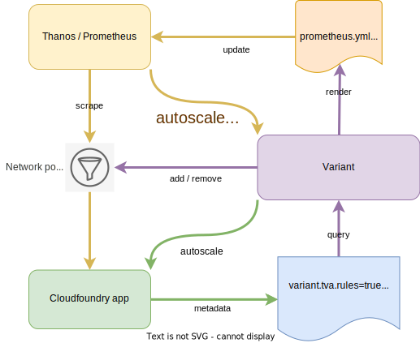

# Variant

A sidecar for [Prometheus / Thanos](https://github.com/philips-labs/terraform-cloudfoundry-thanos) to discover scrape endpoints and rules.
It also manages the required CF network policies to support scraping via `apps.internal` routes. Finally, it can autoscale your CF applications based on arbitrary PromQL statements!

## Disclaimer

This project is not endorsed or supported by HSDP. Use at your own risk.

## Internals
Variant uses the Cloud foundry API to:
- Discover metrics endpoints and scrape targets through CF labels / annotations
- Discover rules (alerts, recorders) through CF labels / annotations
- Creates `rule_files_*.yml` containing discovered rules
- Renders `scrape_configs:` and `rule_files:` sections
- Adds / removes required CF network policies which enable Promethues to scrape target containers
- Writes the `prometheus.yml` config file and triggers Prometheus to reload
- Evaluates autoscaling rules and scales up/down your app accordingly

  

## Setting Labels and Annotations

The [Cloud foundry provider](https://registry.terraform.io/providers/philips-labs/cloudfoundry/latest/docs/resources/app#labels) supports managing
`annotations` and `labels` and we recommend taking this approach. Alternatively, you can use the CF CLI.

### Terraform example

```hcl
resource "cloudfoundry_app" "kong" {
  // Stuff here
  labels = {
    "variant.tva/exporter"   = true
    "variant.tva/rules"      = true
    "variant.tva/autoscaler" = true
  }
  annotations = {
    "prometheus.exporter.port" = "8001"
    "prometheus.exporter.path" = "/metrics"
    "prometheus.exporter.scrape_interval" = "30s"
    "prometheus.rules.json" = jsonencode([
      {
        alert = "KongWaitingConnections"
        expr = "kong_nginx_http_current_connections{state=\"waiting\"} > 2"
        for = "1m"
        labels = {
          severity = "critical"
        }
        annotations = {
          summary = "Instance {{ $labels.instance }} has more than 2 waiting connections per minute"
          description = "{{ $labels.instance }} waiting http connections is at {{ $value }}"
        }
      }
    ])
    "prometheus.exporter.relabel_configs" = jsonencode([
      {
        source_labels = ["__name__"]
        regex = "^(go|process).*$"
        action = "drop"
      }
    ])
    "variant.autoscaler.json" = jsonencode([
      {
        min = 2
        max = 5
        expr = "query_result > 80"
        query = "avg(avg_over_time(cpu{guid=\"{{ guid }}\"}[{{ window }}]))"
      }
    ])
  }
}
```

### CF CLI example

```shell
cf set-label app tempo variant.tva/exporter=true
```

```shell
cf curl v3/apps/GUID \
  -X PATCH \
  -d '{
    "metadata": {
      "annotations": {
        "prometheus.exporter.port": "8001"
      }
    }
  }'
```

## Labels

Labels control which CF apps `variant` will examine for exporters or rules

| Label                         | Description                                                         |
|-------------------------------|---------------------------------------------------------------------|
| `variant.tva/exporter=true`   | Variant will examine this app for Metrics exporter endpoints        |
| `variant.tva/rules=true`      | Variant will look for Prometheus rules in the annotations           |
| `variant.tva/tenant=default`  | Optionally associate the app to a tenant bucket                     |
 | `variant.tva/autoscaler=true` | Variant will look for Autoscaling configurations in the annotations | 

## Annotations

Annotations contain the configurations for metrics and rule definitions

### For exporters

| Annotation                             | Description                          | Default    |
|----------------------------------------|--------------------------------------|------------|
| `prometheus.exporter.port`             | The metrics ports to use             | `9090`     |
| `prometheus.exporter.path`             | The metrics path to use              | `/metrics` |
| `prometheus.exporter.scrape_interval`  | The scrape interval for this app     |            |
| `prometheus.exporter.instance_name`    | The instance name to use (optional)  |            |
 | `prometheues.exporter.relabel_configs` | Relabel configs for this application |            |
| `promethues.targets.port`              | The targets port to use (optional)   |            |
| `prometheus.targets.path`              | The targets path to use (optional)   | `/targets` |

### For rules

| Annotation                | Description                    | Default           |
|---------------------------|--------------------------------|-------------------|
| `prometheus.rules.json`   | JSON string of `[]Rule`        | `jsonecode('[]')` |
| `prometheus.rules.*.json` | JSON string of a `Rule` object |                   |

When both formats are used the rules are merged in the final rule file rendering. This
is useful to circumvent the `5000` character limit for annotation values in CF.

### For autoscaler

| Annotation                | Description               | Default            |
|---------------------------|---------------------------|--------------------|
| `variant.autoscaler.json` | JSON string of `[]Scaler` | `jsonencode('[]')` |

The `Scaler` object has the following attributes 

| Attribute | Description                                                                                                             | Default |
|-----------|-------------------------------------------------------------------------------------------------------------------------|---------|
 | `min`     | Minimum instances to scale to                                                                                           |         |
 | `max`     | Maximum instances to scale to                                                                                           |         |
 | `query`   | The PromQL query to execute                                                                                             |         |
 | `expr`    | The expression to evaluate. Query result is `query_result`. If the expression evaluates to `true` the app will scale up |
 | `window`  | The window to use for queries                                                                                           | `1m`    |

The following placeholders may be used in the query definition

| Placeholder    | Description                                         |
|----------------|-----------------------------------------------------|
 | `{{ guid }}`   | The application GUID. Useful as label in your query |
 | `{{ window }}` | The window as defined in the Scaler object          |


## Limiting scraping scope

In some deployments you may want to limit which apps variant will consider. There are several
ways of achieving this:

- By limiting the CF functional accounts visibility i.e. only add to specific spaces
- By configuring a tenant list and setting `variant.tva/tenant` label accordingly
- By specifying a list of space GUIDs to filter on

### CF functional account visibility

Variant uses the CF API to look for candidate apps to scrap. By simply limiting which spaces your
CF functional account can access you can control which apps are found

### Tenant based filtering

You can label apps with `variant.tva/tenant` label and pass the values to variant through the `--tenants` parameter (comma separated). This
will tell variant to only consider apps label with these tenant values

### CF spaces based filtering

Finally, variant can take a list of CF space GUIDs through the `--spaces` parameter (comma separated). Variant will then only consider apps in these spaces, irrespective of the tenant configuration. This method is useful if you have an all-seeing CF functional account but still want to
limit which apps are considered by variant.

## License

License is MIT
