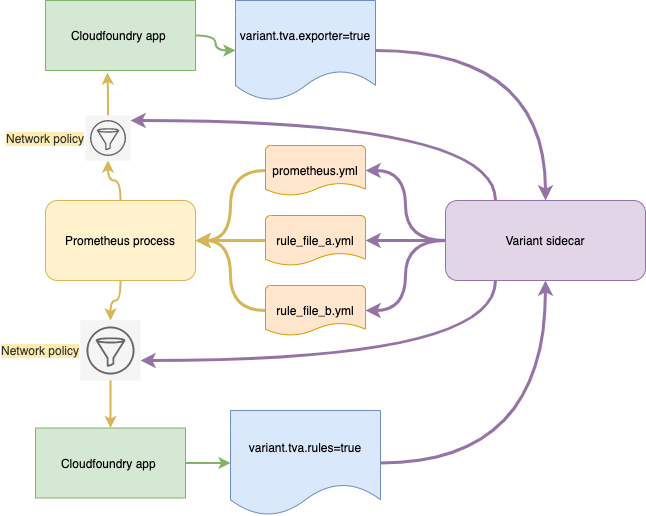

# Variant

A sidecar for [Prometheus / Thanos](https://github.com/philips-labs/terraform-cloudfoundry-thanos) to discover scrape endpoints and rules.
It also manages the required CF network policies to support scraping via `apps.internal` routes.

## Internals
Variant uses the Cloud foundry API to:
- Discover metrics endpoints and scrape targets through CF labels / annotations
- Discover rules (alerts, recorders) through CF labels / annotations
- Creates `rule_files_*.yml` containing discovered rules
- Renders `scrape_configs:` and `rule_files:` sections
- Adds / removes required CF network policies which enable Promethues to scrape target containers
- Writes the `prometheus.yml` config file and triggers Prometheus to reload

  

## Setting Labels and Annotations

The [Cloud foundry provider](https://registry.terraform.io/providers/philips-labs/cloudfoundry/latest/docs/resources/app#labels) supports managing
`annotations` and `labels` and we recommend taking this approach. Alternatively, you can use the CF CLI.

### Terraform example

```hcl
resource "cloudfoundry_app" "kong" {
  ...
  labels = {
    "variant.tva/exporter" = true,
    "variant.tva/rules"    = true,
  }
  annotations = {
    "prometheus.exporter.port" = "8001"
    "prometheus.exporter.path" = "/metrics"
    "prometheus.rules.json" = jsonencode([
      {
        alert = "KongWaitingConnections"
        expr = "kong_nginx_http_current_connections{state=\"waiting\"} > 2"
        for = "1m"
        labels = {
          severity = "critical"
        }
        annotations = {
          summary = "Instance {{ $labels.instance }} has more than 2 waiting connections per minute"
          description = "{{ $labels.instance }} waiting http connections is at {{ $value }}"
        }
      }])
  }
}
```

### CF CLI example

```shell
cf set-label app tempo variant.tva/exporter=true
```

```shell
cf curl v3/apps/GUID \
  -X PATCH \
  -d '{
    "metadata": {
      "annotations": {
        "prometheus.exporter.port": "port"
      }
    }
  }'
```

## Labels

Labels control which CF apps `variant` will examine for exporters or rules

| Label | Description |
|-------|-------------|
| `variant.tva/exporter=true` | Variant will examine this app for Metrics exporter endpoints |
| `variant.tva/rules=true` | Variant will look for Prometheus rules in the annotations |

## Annotations

Annotations contain the configurations for metrics and rule definitions

### For exporters

| Annotation | Description | Default       |
|------------|-------------|---------------|
| `prometheus.exporter.port` | The metrics ports to use | `9090` |
| `prometheus.exporter.path` | The metrics path to use | `/metrics` |
| `prometheus.exporter.instance_name` | The instance name to use (optional) | |
| `promethues.targets.port` | The targets port to use (optional) | |
| `prometheus.targets.path` | The targets path to use (optional) | `/targets` |

### For rules

| Annotation | Description | Default       |
|------------|-------------|---------------|
| `prometheus.rules.json` | JSON string of `[]Rule` | `jsonecode('[]')`
| `prometheus.rules.*.json` | JSON string of a `Rule` object |  |

If both formats are used the rules are merged in the final rule file rendering. This
is useful to circumvent the `5000` character limit for annotation values in CF.

## License

License is MIT
